# Graph Database

> A graph database is an online database management system that runs create, read, update, and delete operations over a graph data model.

## Summary

Hunger, Boyd, and Lyon define the category by its operations, not by its diagram. A graph
database serves transactional workloads, so it holds ACID guarantees and operational
availability. Two properties decide whether a product earns the name: native graph
storage and native graph processing. A native store keeps each node beside its
relationship records. A non-native store layers a graph over a relational or
object-oriented engine, and each hop costs an index lookup. The choice sets the latency
budget for any agent that walks a stored structure at query time.

## Key Concepts

- A graph database runs CRUD over nodes and relationships. It targets online transaction processing.
- Native graph storage builds the engine around the graph. Non-native storage adds latency as volume and query complexity grow.
- Index-free adjacency makes connected nodes point at each other in the store. A join becomes a traversal.
- Neo4j reports constant time traversal, so query time holds steady as the dataset grows.
- Transactions group node and relationship updates into one ACID operation, backed by write-ahead logs and recovery.
- No fixed aggregate boundary exists. The application sets the scope of an update at read or write time.
- Three deployment shapes exist: full migration, split by workload, and duplication across both stores.
- Cypher returns tabular results, so a JDBC driver exposes the graph to an existing ETL or business intelligence tool.

## Detail

### Native storage against relational storage

A relational engine stores a reference and computes the connection later. A foreign key
names a row in another table, and the join matches primary keys to foreign keys at query
time. Those operations consume compute and memory, and the cost rises as a query adds
tables. A native graph engine pre-materialises the connection. Each node holds a list of
relationship records, organised by type and direction, and each record carries its own
properties. A traversal reads that list and reaches the neighbour without a search. Neo4j
calls the result a minutes-to-milliseconds advantage of several orders of magnitude on
join-heavy queries. Attribute the figure to the vendor: the guide is Neo4j advocacy.

### Why depth breaks a join and holds a traversal

Consider the co-purchase recommendation from the guide. A customer bought a product,
peer customers bought the same product, and those peers bought other products. Each arrow
maps to a many-to-many join table with two joins, so the SQL covers six joins across the
three hops. The graph walks three relationship records.

```mermaid
flowchart TB
    subgraph REL["Relational: six joins across three hops"]
        direction LR
        A1["Customer row"] --> A2["JOIN mapping table<br/>on customer_id"]
        A2 --> A3["JOIN Product row<br/>on product_id"]
        A3 --> A4["Self-JOIN mapping<br/>for peer customers"]
        A4 --> A5["Self-JOIN mapping<br/>for peer products"]
        A5 --> A6["Subquery: exclude<br/>products already bought"]
    end
    subgraph GR["Graph: three traversals"]
        direction LR
        B1["Customer node"] -->|BOUGHT| B2["Product node"]
        B2 -->|BOUGHT| B3["Peer Customer node"]
        B3 -->|BOUGHT| B4["Recommended Product node"]
    end
```

The guide measures the SQL at three times the length of the Cypher. Length carries a
second cost. A long statement invites coding mistakes and hides the first developer's
intent from the next reader. Depth compounds the runtime problem. Hierarchies and trees
force recursive self-joins, which the guide names among the longest SQL queries written.

### ACID and the shape of a transaction

A graph database of this class holds full transactional semantics. A transaction groups a
set of node and relationship updates into one atomic, consistent, isolated, and durable
operation. Neo4j supports write-ahead logging and recovery after abnormal termination, so
a committed write survives a crash. The aggregate boundary differs from a document store.
No fixed boundary exists around a group of nodes, so the application declares the scope of
each read or each write. The guide lists the other enterprise properties beside ACID: high
availability, horizontal read scalability, and storage of billions of entities.

### Deployment shapes

The guide sets out three ways to place a graph database against an existing RDBMS. A team
migrates every table into the graph through one bulk load, then retires the relational
store. A team keeps the RDBMS for tabular workloads and routes join-heavy work to the
graph. A team duplicates all data into both stores and queries whichever fits the
question. The second and third shapes are [[polyglot-persistence]]. Duplication adds
architectural complexity and buys the best engine per query. The guide names no correct
choice and points the reader at application goals, frequent use cases, and common queries.

Import runs in two stages. Extraction dumps tables or query results to CSV, or pulls rows
through JDBC. A timestamp or an updated flag drives a repeating sync between the two
stores. Relational engines export bulk data poorly: the guide cites a customer whose MySQL
export ran three days against a Neo4j import of three hours. Loading has three routes:
`LOAD CSV` for ordinary imports, the `neo4j-import` bulk loader for initial population at
one million records per second, and the transactional Cypher HTTP endpoint for programmatic
writes.

### Drivers and connection architecture

The connection layer mirrors the relational stack the reader knows. The Neo4j Browser
answers on `localhost:7474` and fills the role SQL*Plus fills for an RDBMS. Beneath it
sits one REST API. That API posts one or more Cypher statements with parameters per
request, holds a transaction open across requests, selects a result format, and
introspects the database. Language drivers wrap the same endpoints for Java, .NET,
JavaScript, Python, Ruby, PHP, R, Go, Clojure, Perl, and Haskell. Each driver mimics the
idiom of its language. Two paths matter to an RDBMS team. The Neo4j-JDBC driver exposes
Cypher through the JDBC APIs, since Cypher is textual, parameterisable, and tabular in its
results. Spring Data Neo4j sits above the Neo4j-OGM library and supplies object graph
mapping, conversions, transaction handling, and repositories. Parameterise every statement
sent over HTTP or JDBC.

## Trade-offs and Limits

The graph database earns its cost where relationships carry the answer. The guide names
six use cases: fraud detection, real-time recommendation, master data management, network
and IT operations, identity and access management, and graph-based search. Five symptoms
signal that a relational store has passed its limit: many joins in one query, recursive
self-joins, frequent schema changes, slow queries despite tuning and hardware, and
pre-computed results. A query that needs over 100 cores signals a model problem.

The wrong tool test runs the other way. For highly structured data under a predetermined
schema, the guide names the RDBMS the right tool. Tabular workloads with shallow
references gain nothing from a traversal, and paradigm two leaves them in the relational
store. Reporting and analytics tooling assumes SQL, so a graph store reaches those tools
through a JDBC shim. The bulk loader serves initial population alone, since its
optimisations rule out later use. The guide concedes that some graph databases lack
maturity. Two further limits sit outside the engine. Duplication across both stores splits
the write path and raises the risk of drift. The market projections the guide cites, from
Forrester and Gartner, name 2017 and 2018, so they carry no weight now.

## Related

- [[index-free-adjacency]]
- [[polyglot-persistence]]
- [[cypher-query-language]]
- [[knowledge-graph]]
- [[graphrag]]

## Sources

- [[10_Sources/Docs/graph-databases-for-rdbms-developers-neo4j-2021|Graph Databases for the RDBMS Developer]]

## See also

- [[MOC - Concepts]]
- [[MOC - Retrieval]]
