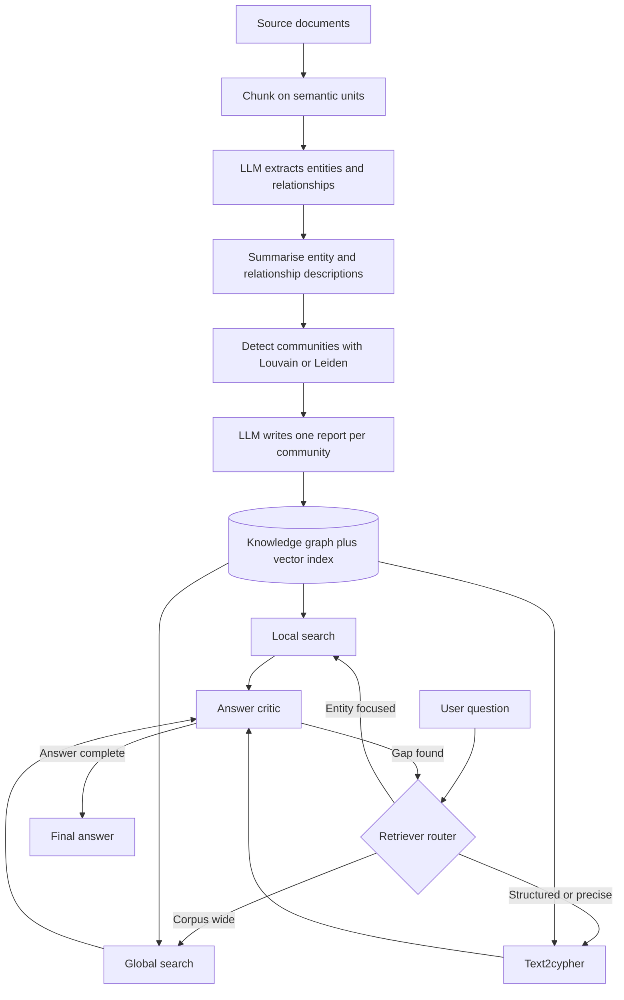

# GraphRAG

> GraphRAG grounds a language model in a knowledge graph, so retrieval follows declared entities and relationships instead of text similarity alone.

## Summary

GraphRAG replaces the flat chunk store of plain RAG with a knowledge graph. The retriever
reads nodes, relationships, community summaries, and the original text from one database.
Bratanič and Hane build the pattern on Neo4j across eight chapters, and Graphwise sells it
as an enterprise semantic layer. The graph holds structured and unstructured data together,
so one system serves fuzzy questions and precise ones. GraphRAG earns its cost on two
question types that defeat vector search: questions that span documents, and questions about
a whole corpus.

## Key Concepts

- Text embeddings retrieve meaning. They fail at filtering, sorting, counting, and aggregation.
- Chunking across many documents returns top-k chunks from the wrong document.
- Indexing extracts entities and relationships with an LLM, detects communities, and summarises each one.
- Local search starts from entities matched by vector search, then expands across the graph.
- Global search runs a map step and a reduce step over community summaries.
- Agentic GraphRAG rests on three parts: a retriever router, retriever agents, and an answer critic.
- Ontology work and entity resolution carry the accuracy, and both cost upfront modelling effort.

## Detail

### The failure GraphRAG addresses

A vector retriever ranks chunks by embedding distance and returns the nearest k. Two facts
held in separate documents never meet. A payment-terms question pulls terms from unrelated
contracts. Graphwise names this failure fragmented facts, and names a false link between
neighbours in vector space a Euclidean proximity error. Multi-hop questions need two to four
jumps between documents, which is what the MuSiQue benchmark tests. A global question such
as "What is this story about?" has no nearest chunk, because no single chunk holds the answer.
Embedding a whole long document fails the other way: averaging blurs distinct ideas.

### Indexing

Indexing runs in two stages. Stage one chunks the text on semantic units. Bratanič and Hane
split The Odyssey along its 24 books, then into 1,000-word chunks with a 40-word overlap. An
LLM extracts typed entities and relationships from each chunk against a fixed entity list.
Their run over the first book produced 66 entities and 182 relationships. One entity collects
many descriptions across chunks, so a second LLM pass merges them into one summary.
Relationship descriptions merge the same way. Microsoft's measurements show smaller chunks
yield more entity references, and extra self-reflection passes yield more again.

Stage two detects communities. A community is a group of entities with more internal
connections than external ones. The book runs Louvain from the Graph Data Science library;
the original Microsoft paper runs Leiden. The worked graph yielded nine communities, sized
two to 13 nodes. An LLM then writes one structured report per community. The report prompt
fixes the shape: title, summary, impact severity rating, rating explanation, and five to 10
detailed findings. These reports precompute the corpus-level knowledge that no chunk holds.

### Retrieval

Local search suits entity-focused questions. The system embeds each entity summary into a
vector index. A question matches entities by similarity, and those entities become entry
points. A single Cypher statement then pulls connected text chunks, connected relationships,
connected entities, and the community summaries above them. Each class is ranked and capped,
so the context fits the window. Chunks rank by how many matched entities they touch;
communities rank by rank and weight. Vector search finds the door, and the graph supplies the
rooms behind it.

Global search suits corpus-wide questions. The map step sends each qualifying community report
to the LLM alongside the question, and the LLM returns key points with importance ratings. A
rating threshold filters weak communities before the map step. The reduce step merges the top
points into one answer. Community level sets the trade: low levels give detail at the cost of
LLM calls and latency, high levels lose granularity.

### Agentic GraphRAG

Agentic GraphRAG puts an agent in front of the retrievers. A retriever router, an LLM with
tool definitions, reads the question and picks the retriever plus its arguments. Retriever
agents range from a hardcoded Cypher template, such as movie by title, to text2cypher as the
catch-all behind the specialised ones. An answer critic then inspects the retrieved context.
It releases the answer, or writes a new question and sends it back through the router. The
loop needs an exit condition for data the graph does not hold. Bratanič and Hane implement
the router through OpenAI function calling and name [[react]] as the route for models without
tool support, which places the pattern inside [[the-agent-loop]] and [[tool-use]].

### Where the cost pays back

Graphwise sets adoption criteria: facts spread across hundreds of documents, mandatory
provenance and citation in a regulated setting, business rules and interdependencies that
retrieval alone misses, and thematic questions that synthesise a pattern across many
datapoints. Graphwise reports an internal MuSiQue benchmark where accuracy climbs from 71% to
95% across four architectures, with its own Semantic GraphRAG at the top. It also reports a
manufacturing case moving from 35 to 40% accuracy to near 80%, with 85 to 90% reachable
through further domain modelling. These figures are Graphwise's own and carry no third-party
audit. Bratanič and Hane report the measured alternative: a 17-example RAGAS benchmark scoring
0.7774 on answer correctness, 0.7941 on context recall, and 0.9657 on faithfulness.

## Trade-offs and Limits

GraphRAG buys multi-hop reach and traceable answers with indexing cost. Extraction, entity
summarisation, and community summarisation each spend LLM calls before the first question
arrives. Louvain lacks determinism, so communities shift between runs on one graph. Skipping
entity resolution leaves several nodes for one real-world entity and corrupts counts and
traversals. A single generic resolution rule fails across domains; financial thresholds
misfire on biomedical entities. Super nodes accumulate relationships past the prompt budget
and need ranking. Text2cypher adds an LLM call and raises latency on every query that uses it.

Graphwise names three cases to avoid: single-document retrieval, real-time question answering
where latency binds, and broad abstract queries that name no entity, since traversal has no
starting point. It also states the obvious guard: keep traditional RAG where the existing
pipeline performs. The book adds a matching warning on agents. Its worked agent failed "Who
has the longest name among all actors?" because it could not write the Cypher, which points to
a few-shot example or a dedicated tool as the fix. Ontology and taxonomy design remain upfront
work that no pipeline removes.

## Related

- [[knowledge-graph]]
- [[retrieval-augmented-generation]]
- [[react]]
- [[the-agent-loop]]
- [[tool-use]]
- [[evaluation]]

## Sources

- [[10_Sources/Books/essential-graphrag-bratanic-2025|Essential GraphRAG]]
- [[10_Sources/Docs/semantic-advantage-graphrag-graphwise-2026|The Semantic Advantage (Graphwise)]]
- [[10_Sources/Docs/how-to-build-a-knowledge-graph-neo4j-2025|How to Build a Knowledge Graph (Neo4j)]]

## See also

- [[MOC - Concepts]]
- [[MOC - Retrieval]]
