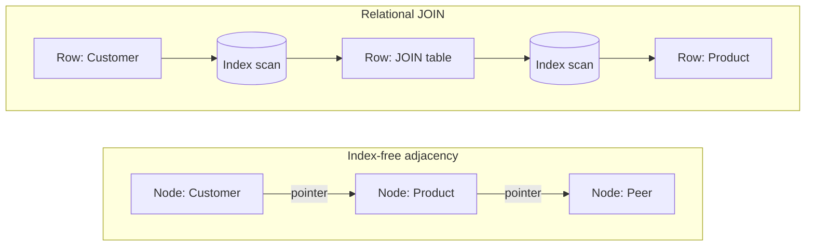

# Index-Free Adjacency

> Index-free adjacency stores a list of relationship records inside each node, so a traversal follows pointers instead of searching a global index.

## Summary

Index-free adjacency names the storage and processing model behind a native graph
database. Each node holds a list of relationship records that point at its neighbours.
A query that walks from one node to the next reads that list and reaches the connected
node. No index lookup sits between the two. Neo4j calls this native graph processing.
For retrieval work, the property decides whether a multi-hop question answers in
milliseconds or in minutes.

## Key Concepts

- Each node contains a list of relationship records. The records carry a type, a direction, and properties.
- A traversal follows a pointer. One hop costs what the local degree costs, not what the dataset size costs.
- A relational JOIN matches primary keys against foreign keys at query time, through an index over the table.
- Neo4j describes the relationships as pre-materialised. The write pays once; every later read follows the stored pointer.
- Non-native graph processing layers a graph over a relational or object-oriented engine. The index lookup returns, and latency with it.

## Detail

Relationships in a relational schema live as metadata. A foreign key column records a
reference. The database computes the connection when the query runs. The engine reads
the index for the target table, matches keys, and assembles rows. That search-and-match
step scales with the row count. The Neo4j guide describes these operations as compute
and memory intensive, with an exponential cost as queries grow.

Index-free adjacency moves the work to write time. Creating a relationship writes a
record into the node structure. A later traversal reads the record and jumps to the
neighbour. Neo4j states the traversal is a constant time operation, so query time holds
as the dataset grows.

Depth is where the two models separate. A recommendation query walks from a customer to
a product, out to a peer customer, and on to that peer's products. Neo4j maps each hop
to a many-to-many JOIN table costing two JOINs, so the relational form carries six
JOINs. The graph form reads three relationship lists.

## Trade-offs and Limits

The model rewards a query anchored at a known start node. Finding that start node needs
an index, which is why Neo4j advises unique constraints on business keys and indexes on
frequent lookup attributes. Pointer following begins after the anchor resolves.

Writes carry the cost. Every relationship creation and deletion maintains the pointer
structure inside the connected nodes. Bulk loading suffers most, which is why Neo4j
ships a separate parallel loader, `neo4j-import`, and reserves it for initial
population.

Set-wide aggregate scans fit the model poorly. A query that sums a column across every
row gains nothing from adjacency, since it visits all records regardless of connection.
Neo4j offers polyglot persistence as the answer: keep tabular workloads in the
relational store, and route JOIN-heavy and relationship workloads to the graph.

Treat the performance figures with care. Neo4j claims a minutes-to-milliseconds
advantage of several orders of magnitude for JOIN-heavy queries. The guide is vendor
advocacy and supplies no independent benchmark.

## Related

- [[graph-database]]
- [[cypher-query-language]]
- [[polyglot-persistence]]
- [[knowledge-graph]]
- [[graphrag]]

## Sources

- [[10_Sources/Docs/graph-databases-for-rdbms-developers-neo4j-2021|Graph Databases for the RDBMS Developer]]

## See also

- [[MOC - Concepts]]
- [[MOC - Retrieval]]
