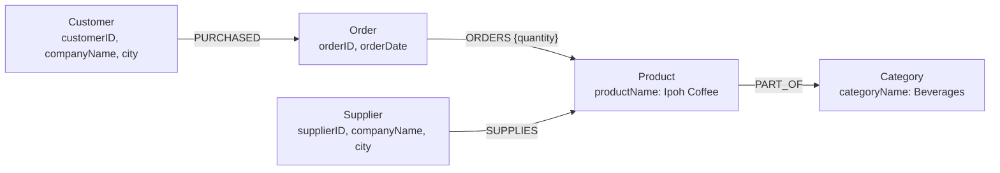

# Knowledge Graph

> A knowledge graph maps entities, which are objects, events, or concepts, and their relationships into one interconnected structure.

## Summary

Neo4j names three components of a knowledge graph: nodes, relationships, and organising
principles. Nodes hold the entities. Relationships record how two entities interact.
Organising principles supply business context through hierarchies and categories. The
store holds structured and unstructured data together, so one system answers a fuzzy
question and a precise one. Bratanič and Hane build retrieval-augmented generation on
that store. For an agent, a knowledge graph turns retrieval into traversal over named
connections rather than a similarity guess.

## Key Concepts

- A node is an instance of an entity. A relationship is a named, directed connection between two nodes.
- Labels classify a node by role. Properties hold key-value attributes on nodes and on relationships.
- Relationships are first-class. A relational store records a reference and computes the connection at query time.
- Index-free adjacency stores each node beside its relationship records, so a traversal replaces a join.
- The conceptual model and the physical model are one artefact. The whiteboard sketch is the stored structure.
- Embeddings retrieve meaning. They fail at filtering, sorting, counting, and aggregation.
- Entity resolution merges the records that reference one real-world entity.

## Detail

### The property graph model

A property graph carries four elements: nodes, relationships, labels, and properties. A
node takes one label or several, such as a `Server` label and a general `Asset` label,
so one query targets a type and another sweeps every instance. A relationship carries a
type, a direction, and properties of its own. Direction states the business meaning:
`Customer-PURCHASED->Order` describes a completed sale, and `Customer-CREATES->Order`
describes an unpurchased cart.

Cypher queries that structure. Its pattern syntax mirrors the diagram: parentheses draw
nodes, dashes and angle brackets draw direction, a colon prefixes a label or a
relationship type. One `MATCH` walks customer, order, product, category, and supplier in
a single pattern. `MERGE` runs find-or-create over a pattern, which keeps repeated
imports idempotent.

### Against a relational schema

Hunger, Boyd, and Lyon map the two models element by element. Each entity table becomes
a node label. Each row becomes a node. Columns become properties. Foreign keys become
relationships, then the foreign key columns go. A join table becomes a relationship, and
its columns become relationship properties. The join itself disappears. A relational
model reaches production through a design, normalise, and denormalise cycle, and each
requirement change costs a migration measured in weeks. A graph schema admits new entity
types and relationship types without that migration. Query time holds steady as the
dataset grows, because a pre-materialised relationship is a constant time hop.

### Against a vector index

A vector index retrieves by semantic similarity. It answers a fuzzy question over
unstructured text. It breaks on any question that needs filtering, sorting, counting, or
aggregation. Chunking across many documents compounds the problem: a payment-terms
question pulls terms from unrelated contracts. A knowledge graph holds both. The graph
stores the extracted entities and the original chunks side by side, with the embedding on
the chunk and a vector index over it. Hybrid search adds a full-text index for exact term
matching. Structure answers the precise question; embeddings answer the rest.

### Entity resolution

One real-world entity arrives as several records. "Limited" and "Ltd" name one company.
Skipping the merge leaves duplicate nodes, and duplicate nodes corrupt counts and
traversals. A graph reduces the cost of the merge. Shared identifiers and attributes
model as separate nodes, which exposes merge candidates. Weakly connected components
segments the graph into communities, and nodes in separate communities need no
comparison. The graph also handles the transitive case, where three or more records
resolve to one entity. Matching rules stay domain-specific. A financial threshold
misfires on biomedical entities, so subject matter experts set the criteria.

### Ontologies and schema

Organising principles give the graph its ontology. They specify node types and
relationship types, then establish hierarchies and categories over them. In a healthcare
graph, diseases group into cardiovascular and respiratory categories, and patients group
by risk factor or age range. Analysis then runs at the patient level or the population
level. Choose the entity types before extraction, since they shape extraction, linking,
and summary quality. Unique constraints on every node key protect integrity and query
speed. The schema earns a second job at query time: a text2cypher prompt carries the
labels, relationship types, and properties, and forbids anything outside them.

### Why an agent benefits

An agent reads a knowledge graph through tools. Bratanič and Hane wrap each retriever as
a function with a JSON description. A router picks the retriever and extracts its
arguments. Specialised Cypher templates cover the frequent questions, and text2cypher
sits behind them as the catch-all. An answer critic inspects the retrieved context, then
releases the answer or issues a new question for another round. The graph gives the agent
three things a chunk store withholds: a schema it reads, an aggregate it computes, and a
path it walks between two entities. Each answer traces back to a node, so the agent
cites its source.

## Trade-offs and Limits

A knowledge graph earns its cost where connections carry the answer. Multi-hop questions,
supplier concentration risk, and recommendation over shared purchases all resolve in one
pattern. The cost lands before the first query. The team designs the model, sets the
organising principle, and writes entity resolution rules per domain. Extraction from
unstructured text adds LLM calls and latency, and text2cypher adds one call per query.
Community detection through Louvain returns different communities between runs on one
graph. A `MERGE` over a whole pattern creates duplicate nodes where the nodes exist and
the relationship does not.

## Related

- [[graphrag]]
- [[retrieval-augmented-generation]]
- [[memory]]
- [[tool-use]]
- [[evaluation]]

## Sources

- [[10_Sources/Docs/how-to-build-a-knowledge-graph-neo4j-2025|How to Build a Knowledge Graph]]
- [[10_Sources/Docs/graph-databases-for-rdbms-developers-neo4j-2021|Graph Databases for the RDBMS Developer]]
- [[10_Sources/Books/essential-graphrag-bratanic-2025|Essential GraphRAG]]

## See also

- [[MOC - Concepts]]
- [[MOC - Retrieval]]
