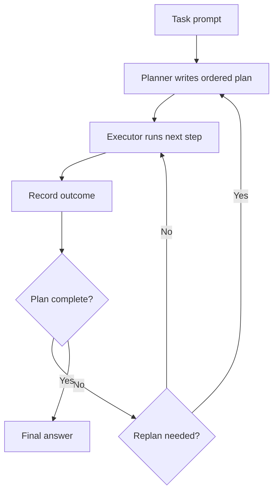

# Plan-and-Execute

> Plan-and-Execute splits a task in two: a planner writes an ordered plan, then an executor runs each step.

## Summary

Plan-and-Execute separates planning from action. A planner reads the task and writes an
ordered list of steps. An executor runs each step, often through a ReAct loop, and
reports the result. The plan holds the global structure the step-by-step loop lacks. The
pattern traces to Plan-and-Solve prompting by Wang and colleagues in 2023 and to agent
frameworks that split the planner and the executor into separate calls.

## How It Works

The planner produces a plan once, up front. The executor takes the first step, acts, and
records the outcome. A control step checks the outcome against the plan. The executor
moves to the next step or the planner revises the plan. The loop ends when the plan
completes or a replan gives up.

State lives in the plan and the record of completed steps. The decision points sit at the
outcome check and the replan gate.

## Strengths

- Holds a global plan, so it keeps direction on multi-stage tasks.
- Separates a strong planner model from a cheap executor model.
- Makes the intended path visible before any action runs.
- Reduces wander compared with a single step-by-step loop.

## Weaknesses

- A flawed plan sends the executor down a wrong path.
- A rigid plan resists new evidence unless a replan fires.
- Two roles raise the call count and the cost.
- Replanning adds latency on tasks that shift often.

## Appropriate Use Cases

- Multi-step tasks with a clear structure, such as a research report.
- Data pipelines where the order of steps matters.
- Tasks where a cheap executor runs many steps under one plan.
- Long-horizon work that a flat loop cannot hold.

## Implementation Complexity

Moderate. It needs a planner prompt, an executor loop, an outcome check, and a replan
path. The replan logic carries the most risk.

## Scalability

The pattern scales to long tasks better than a flat loop. The plan bounds the horizon. A
plan that grows too large strains the planner and the outcome check.

## Maintenance Implications

Watch the replan trigger; a loose trigger replans too often, a tight one never adapts.
Watch the planner output format. Cap the replan count to stop cycles.

## Related

- [[planning-and-reasoning]]
- [[react]]
- [[supervisor-worker-multi-agent]]
- [[the-agent-loop]]
- [[workflow-vs-autonomous-agent]]

## Sources

- Wang et al., "Plan-and-Solve Prompting". ACL 2023. https://arxiv.org/abs/2305.04091
- [[10_Sources/Papers/react-yao-2022|ReAct (Yao et al., 2022)]]
- Anthropic, "Building effective agents". https://www.anthropic.com/engineering/building-effective-agents

## See also

- [[MOC - Architectures]]
- [[MOC - Planning]]
