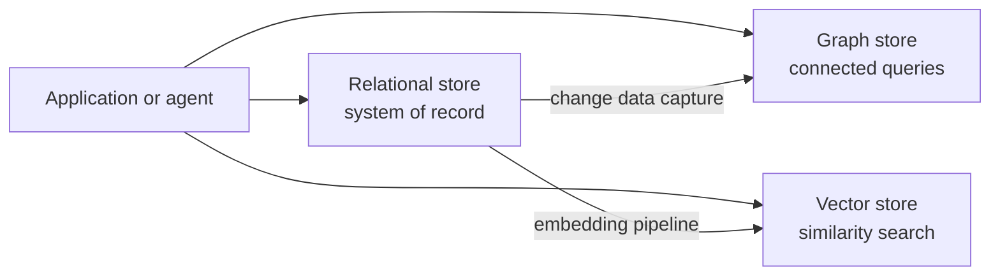

# Polyglot Persistence

> Polyglot persistence runs several data stores in one system, each chosen for the shape of the workload it serves.

## Summary

Polyglot persistence uses more than one data store, each for its strength. The Neo4j guide
names it as the second and third of three deployment paradigms for a graph database beside a
relational database. One team routes tabular workloads to the RDBMS and relationship
workloads to the graph. Another team duplicates all data into both stores and queries
whichever fits. The guide states the cost in one line: the approach adds complexity to the
architecture, and it returns the best database for each query. That trade sits at the centre
of every retrieval stack an agent reaches through tools.

## Key Concepts

- A store encodes an access pattern. The relational engine serves set operations over rows; the graph engine serves traversal over connected data.
- The relational model stores entities well and relationships poorly. JOIN cost rises with table count and depth.
- Denormalisation buys relational speed by duplicating data and distorting the user's model to suit the engine.
- Two stores means two copies of the truth. Synchronisation, not query speed, becomes the hard problem.
- Full migration into one store remains a valid answer. The guide names no correct paradigm.

## Detail

The case against a single general-purpose store rests on query shape. A normalised relational
schema answers ad hoc questions in theory. In practice the team adapts the model for specific
access patterns, then pays for that adaptation in duplicated data and slow migrations. A
recursive self-JOIN over a hierarchy produces some of the longest SQL written. A graph engine
answers the same question by traversal at constant cost per hop. Neither engine wins every
workload, so the architecture splits the workload instead.

The common modern shape uses three stores. A relational database holds the system of record,
enforces constraints, and serves transactional writes. A graph store holds entities and named
relationships, and answers multi-hop questions about how records connect. A vector store holds
embeddings and answers similarity questions over unstructured text. Each store reads from the
same domain and exposes a different view of it.

Synchronisation carries the cost. Three routes exist. Dual writes send every change to both
stores from the application, and a partial failure leaves the copies in disagreement. Change
data capture reads the transaction log of the system of record and replays changes downstream,
which keeps the write path single and adds a pipeline to operate. Batch extraction pulls rows
on a timestamp or an updated flag, which the Neo4j guide recommends for a graph running beside
an RDBMS. Every route accepts eventual consistency. A query against the graph or the vector
index reads a state the relational store left behind minutes ago.

Operational cost compounds the data cost. Each engine brings its own backup schedule, upgrade
path, monitoring, access control, and failure mode. Each brings a query language the team must
learn and review. A three-store stack needs staff who understand SQL, [[cypher-query-language]],
and embedding pipelines. Bulk export from a relational database runs slow, so the initial load
takes planning: the guide cites a customer whose MySQL export took three days against a Neo4j
import of three hours.

One store answers better in three cases. The dataset stays small enough that JOIN depth costs
nothing. One query shape dominates the application. The team lacks the headcount to operate a
second engine. The guide's first paradigm covers the fourth case: migrate every table into the
graph in one bulk load and retire the RDBMS.

For an agent, each store becomes a tool. The model chooses the backend, so the routing decision
moves from the architect into the tool description. A tool named for its workload, such as
"search related entities" against the graph and "find similar passages" against the vector
index, guides that choice. A tool named for its engine does not. Staleness surfaces as
contradiction: the agent reads a fresh row from the system of record and a stale neighbour from
the graph, then reports both. Name the freshness of each store in its tool description, and
treat the system of record as the authority when answers conflict.

## Trade-offs and Limits

Polyglot persistence helps where query shapes diverge and one engine strains under half of them.
It returns the optimal result per query and keeps each model close to its domain. It costs a
synchronisation pipeline, eventual consistency, and the operational load of several engines. It
fails where a team adopts a second store before the first one strains, or where no owner takes
responsibility for the sync path. Measure the strain first, then split the workload.

## Related

- [[graph-database]]
- [[retrieval-augmented-generation]]
- [[tool-use]]
- [[knowledge-graph]]
- [[graphrag]]
- [[index-free-adjacency]]
- [[cypher-query-language]]
- [[memory]]

## Sources

- [[10_Sources/Docs/graph-databases-for-rdbms-developers-neo4j-2021|Graph Databases for the RDBMS Developer]]

## See also

- [[MOC - Concepts]]
- [[MOC - Retrieval]]
