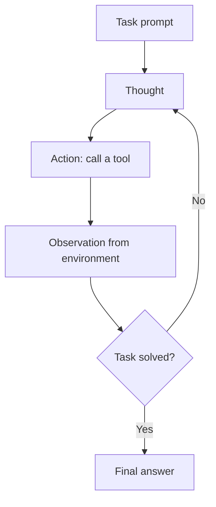

# ReAct

> ReAct interleaves reasoning traces and tool actions in one loop, so the model plans, acts, and reads results in turn.

## Summary

ReAct joins reasoning and acting in a single language model loop. The model writes a
thought, chooses an action, and reads the observation the environment returns. The
thought plans the next action. The action fetches evidence that grounds the next thought.
This loop solves tasks that need both reasoning and fresh external data. Yao and
colleagues named the pattern in 2022 and it now anchors most tool-using agents.

## How It Works

The loop holds three moves: thought, action, and observation. The model emits a thought
that names its intent. It emits an action that calls a tool. The environment returns an
observation. The model reads the observation and writes the next thought. The loop ends
when the model emits a finish action.

State lives in the growing trace of thoughts, actions, and observations. The decision
point sits at each thought: reason again, act again, or finish.

## Strengths

- Grounds reasoning in fresh evidence, which cuts hallucination.
- Produces a trace a human reads to audit the decision path.
- Suits any task with a tool interface.
- Needs no fine-tuning; few-shot exemplars teach the format.

## Weaknesses

- A wrong early action derails the whole trajectory.
- The model loops on the same action when no new observation arrives.
- Long traces consume context and raise cost.
- The loop lacks a global plan, so it wanders on multi-stage tasks.

## Appropriate Use Cases

- Question answering over a search or knowledge base.
- Fact verification against a live source.
- Interactive tasks in a tool-rich environment.
- Any single-agent task that mixes reasoning and tool calls.

## Implementation Complexity

Low. A prompt template, a tool executor, and a loop suffice. Most agent frameworks ship
a ReAct loop out of the box.

## Scalability

The loop scales with the tool count and the task depth. A large action space strains the
model choice at each step. Long horizons fill the context window and force truncation or
summary.

## Maintenance Implications

Watch the tool schemas; a changed tool breaks the action format. Watch trace length and
cost. Cap the step budget to stop runaway loops.

## Related

- [[the-agent-loop]]
- [[tool-use]]
- [[reflexion]]
- [[planning-and-reasoning]]
- [[plan-and-execute]]

## Sources

- [[10_Sources/Papers/react-yao-2022|ReAct (Yao et al., 2022)]]
- Anthropic, "Building effective agents". https://www.anthropic.com/engineering/building-effective-agents

## See also

- [[MOC - Architectures]]
- [[MOC - Agent Patterns]]
