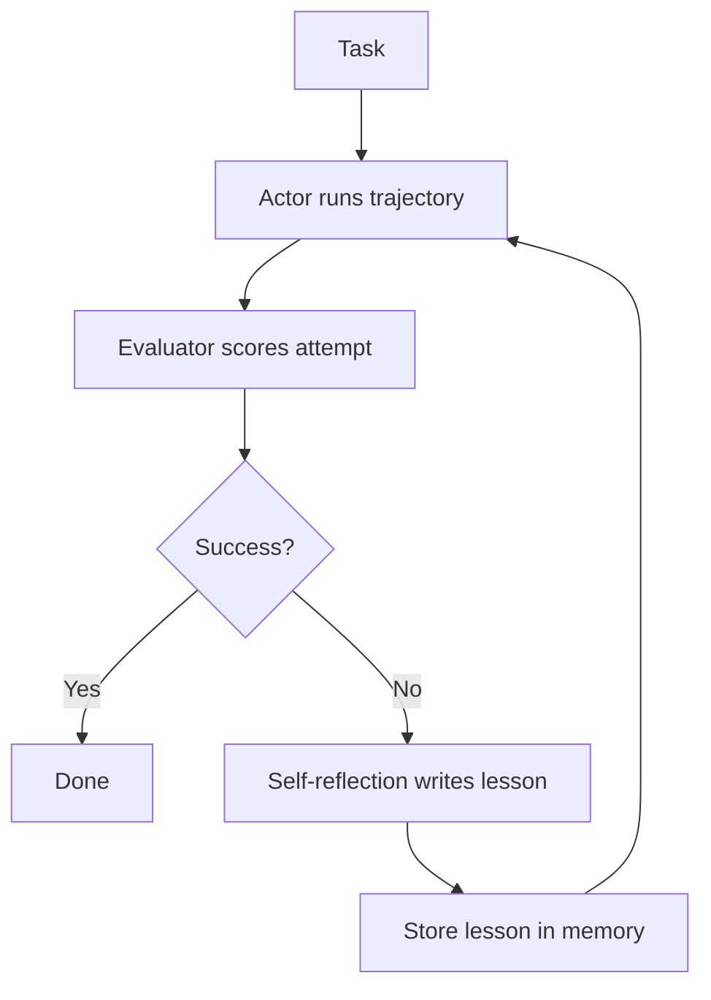

# Reflexion

> Reflexion writes a self-critique after each failed attempt, stores it in memory, and reads it on the next try.

## Summary

Reflexion learns from failure through written self-critique. The agent attempts a task,
receives a feedback signal, and writes a reflection on what went wrong. It stores the
reflection in an episodic memory buffer. The next attempt reads the reflection and
adjusts. No weight update occurs; the language of the reflection carries the learning.
Shinn and colleagues introduced the method in 2023, reaching 91% pass@1 on HumanEval.

## How It Works

Reflexion holds three roles: the actor, the evaluator, and the self-reflection model.
The actor runs a trajectory, often through a ReAct loop. The evaluator scores the
attempt, from a reward or a test result. The self-reflection model turns the score and
the trace into a short lesson. The lesson enters memory. The next trial reads the lesson.

State lives in the episodic memory of reflections. The decision point sits at the
evaluator: succeed and stop, or fail and reflect.

## Strengths

- Improves across trials without any weight update.
- Turns failure into a specific, reusable lesson.
- Pairs with a reliable evaluator, such as unit tests.
- Wraps an existing actor, such as a ReAct agent.

## Weaknesses

- A weak evaluator produces a misleading reflection.
- A vague reflection fails to change the next attempt.
- Many trials raise cost and latency.
- The memory buffer grows and needs a cap.

## Appropriate Use Cases

- Code generation checked by a test suite.
- Reasoning tasks with a clear correct answer.
- Interactive tasks that allow retries under a budget.
- Any loop where an evaluator gives a trustworthy signal.

## Implementation Complexity

Moderate. It needs an actor, an evaluator, a reflection prompt, and a memory store. The
evaluator quality drives the whole result.

## Scalability

The pattern scales with the trial budget, not the task breadth. More trials cost more
tokens. A trustworthy evaluator bounds the number of trials the agent needs.

## Maintenance Implications

Watch the evaluator; a drifting evaluator poisons the memory. Cap the buffer and prune
stale lessons. Cap the trial count to bound cost.

## Related

- [[react]]
- [[memory]]
- [[planning-and-reasoning]]
- [[evaluation]]
- [[the-agent-loop]]

## Sources

- [[10_Sources/Papers/reflexion-shinn-2023|Reflexion (Shinn et al., 2023)]]
- [[10_Sources/Papers/react-yao-2022|ReAct (Yao et al., 2022)]]

## See also

- [[MOC - Architectures]]
