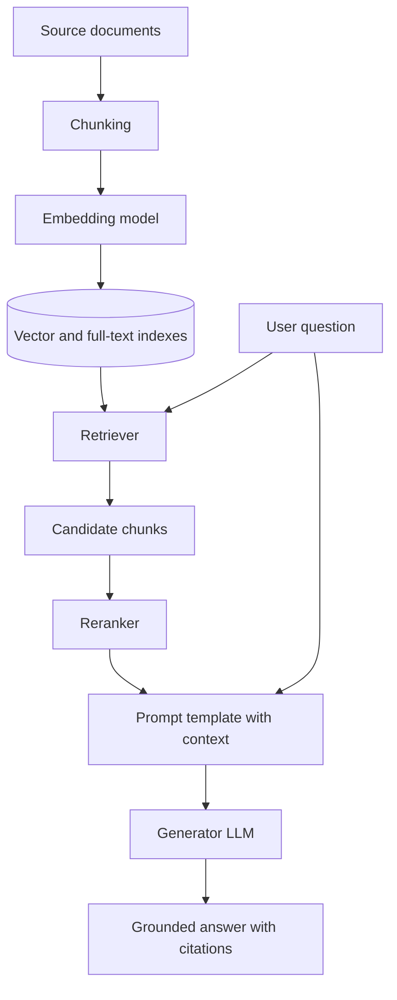

# Retrieval-Augmented Generation

> Retrieval-augmented generation fetches relevant text from an external store at query time, then hands it to a language model as the context for its answer.

## Summary

A language model holds a fixed training corpus and a knowledge cutoff. It cannot
read private enterprise data, and it invents facts under uncertainty. RAG closes
that gap without touching the model weights. A retriever searches an external
knowledge base for text that matches the question. A generator writes the answer
from that retrieved text. Bratanič and Hane reject continuous finetuning as the
route to fresh facts, and cite research showing that language models struggle to
learn new facts this way. RAG changes the data instead of the model, so a
document update reaches the answer on the next query.

## Key Concepts

- RAG splits into two components: a retriever that finds text, and a generator that writes the answer.
- Chunking divides source documents into retrievable units. One chunk carries one idea.
- An embedding model maps each chunk to a dense vector, where nearness in the vector space tracks nearness in meaning.
- Vector search returns the nearest neighbours of the query vector, through approximate nearest neighbour indexes such as HNSW.
- Sparse retrieval scores terms against documents inside an inverted index. Dense retrieval compares embeddings.
- Hybrid search merges a lexical ranking with a semantic ranking, then fuses the two rank lists.
- Reranking re-scores the top candidates with a cross-encoder that reads the query and the chunk together.
- Grounding ties every claim in the answer to a retrieved passage, which cuts hallucination and supports citation.

## Detail

### The two-stage pipeline

Indexing runs before any query arrives. The pipeline splits each document into
chunks, embeds each chunk, and writes the vectors to an index. Query time runs
the second stage. The retriever embeds the question, searches the index, and
returns the top candidates. A reranker narrows those candidates. The generator
receives the survivors inside a prompt template beside the user question.

### Chunking

Chunking governs retrieval quality more than the choice of embedding model.
Bratanič and Hane split text on structural elements, sections and paragraphs,
before splitting on character count. They count tokens per chunk before import
and drop chunks of 20 tokens or fewer. Their parent document retriever embeds
500-character child chunks and returns the parent document of at most 2,000
characters. Precision comes from the child; context comes from the parent.
Embedding a whole long document blurs distinct ideas through averaging.

### Embeddings and vector search

A dense embedding is a high-dimensional numeric representation of text. Elastic
describes similarity in meaning as nearest-neighbour distance in that space. The
same model embeds the knowledge base and the query, so search reduces to a
nearest-neighbour lookup. Elastic points to approximate nearest neighbour search
with HNSW, implemented in Lucene, as the vector store behind its own product.
Dense vector search draws heavily on compute and storage.

### Sparse against dense retrieval

A sparse encoder returns relevance scores for words and documents rather than an
embedding. It expands a document with terms by relevance, and defers the
comparison of query scores against document scores. Sparse vectors sit in the
same inverted indices as keyword search, so no nearest-neighbour tuning is
needed. Elastic reports out-of-the-box BEIR scores of 0.53 for its own ELSER,
0.49 for E5-base, and 0.48 for SPLADE, against 0.41 for BM25. It also reports
ANCE at 0.380 and TAS-B at 0.404 against BM25 at 0.416, which shows a dense
model scoring below the lexical baseline without domain adaptation. Read every
figure as Elastic's own measurement. Elastic puts fine tuning of an embedding
model at weeks to months, on GPU hardware.

### Hybrid search and rank fusion

Lexical and semantic ranking complement each other. Keyword search handles
single-word queries, exact brand matches, and domain terminology. Embedding
models handle multi-word queries, concept searches, and questions. Two fusion
methods dominate. Reciprocal rank fusion needs no parameter tuning and no score
normalisation. Linear combination weights each ranking, stays interpretable, and
needs normalised scores plus annotations. Optimal weights shift between datasets.
Elastic reports NDCG@10 averages over a BEIR subset of 0.439 for BM25, 0.512 for
ELSER, 0.519 for hybrid RRF, and 0.543 for a tuned linear combination. Elastic
treats rank combination as the first relevance improvement to try.

### Reranking

Retrieval and reranking form a cheap-then-expensive pair. The first pass returns
a wide candidate set at low cost. The second pass sends each candidate through a
cross-encoder that reads the query and the chunk together. The AI Builder Club
lesson holds that reranking moves retrieval quality more than a change of
embedding model. Essential GraphRAG names reranking, metadata filtering, and
hypothetical question embedding as techniques it describes without code.

### Grounding against hallucination

Grounding is the point of the pattern. The prompt instructs the model to answer
from the provided sources, and to say so when the sources fail to cover the
question. Without that instruction, a model fills retrieval gaps with fluent
invention. Faithfulness measures whether every claim in the answer follows from
the retrieved context. Bratanič and Hane evaluate with RAGAS across three
metrics: context recall, faithfulness, and answer correctness. Their 17-example
benchmark scored 0.7941 on context recall, 0.9657 on faithfulness, and 0.7774 on
answer correctness. See [[evaluation]] for the wider measurement picture.

## Trade-offs and Limits

RAG competes with two other ways to give a model working knowledge. A static
corpus under roughly 50K tokens belongs in the context window, where retrieval
infrastructure and its latency buy nothing. A large or changing corpus that needs
citations belongs in RAG. A change of model behaviour or style belongs to fine
tuning, which teaches form rather than fact. Production systems layer more than
one. Finetuning an embedding model forces a recompute of every stored embedding.

Embeddings fail at filtering, sorting, counting, and aggregation. Those
operations need structured data. Chunking across many documents returns top-k
chunks from the wrong document, so a payment-terms question pulls terms from
unrelated contracts. Graphwise names two further failure signals in a flat
pipeline: a Euclidean proximity error infers a false relationship from two items
sitting near each other in vector space, and an aggregation failure leaves
scattered evidence unassimilated. Graphwise reports these as its own analysis.
[[graphrag]] answers both by retrieving over a [[knowledge-graph]] of declared
entities and relationships.

The fixed chunk-and-embed pipeline of 2023 loses ground to agentic retrieval.
There the model receives search as a tool and iterates: search, read, refine,
search again. That loop costs latency and tokens, and it wins on messy document
sets where one upfront retrieval has no path to recovery. See [[tool-use]] and
[[react]] for the loop it runs inside.

## Related

- [[memory]]
- [[evaluation]]
- [[tool-use]]
- [[knowledge-graph]]
- [[graphrag]]
- [[prompt-engineering]]
- [[react]]
- [[the-agent-loop]]

## Sources

- [[10_Sources/Books/essential-graphrag-bratanic-2025|Essential GraphRAG]]
- [[10_Sources/Docs/semantic-search-ai-era-elastic-2023|Semantic Search in the AI Era (Elastic)]]
- [[10_Sources/Docs/semantic-advantage-graphrag-graphwise-2026|The Semantic Advantage (Graphwise)]]
- [[10_Sources/Blog/rag-vs-long-context-vs-fine-tuning|RAG vs Long Context vs Fine-Tuning]]

## See also

- [[MOC - Concepts]]
- [[MOC - Retrieval]]
