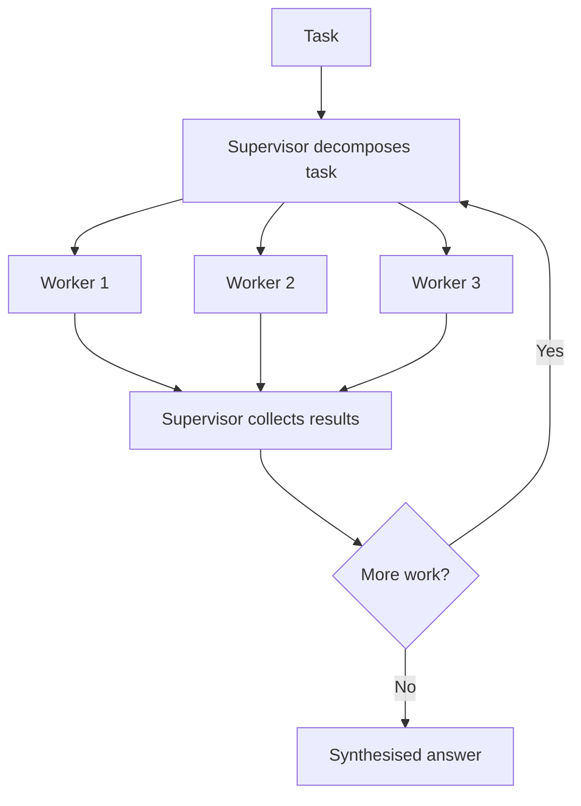

# Supervisor-Worker Multi-Agent

> A supervisor agent decomposes a task and delegates each part to a worker agent, then combines the results.

## Summary

The supervisor-worker pattern splits a task across agents. A supervisor reads the task,
breaks it into parts, and assigns each part to a worker. Each worker runs its own loop
with its own tools and context. The supervisor collects the results and synthesises the
answer. The pattern isolates context per worker and runs independent parts in parallel.
Anthropic calls the core form orchestrator-workers in its agent guidance.

## How It Works

The supervisor holds the plan and the task queue. It spawns a worker per subtask. Each
worker holds a private context, calls its own tools, and returns a result. The supervisor
reads each result, decides whether to spawn more workers, and synthesises the final
output.

State splits between the supervisor plan and each worker context. The decision points sit
at decomposition and at the synthesis gate.

## Strengths

- Isolates context per worker, which holds long tasks within the window.
- Runs independent subtasks in parallel, which cuts wall-clock time.
- Assigns a focused toolset and prompt to each worker.
- Scales to a task no single loop holds.

## Weaknesses

- Coordination adds tokens and latency across agents.
- A poor decomposition wastes worker effort.
- Workers duplicate work when the supervisor briefs them poorly.
- Debugging spans many traces, which raises the effort.

## Appropriate Use Cases

- Research over many sources, one worker per source.
- Codebase tasks split across modules.
- Broad tasks where subtasks run apart with clean boundaries.
- Work that exceeds a single context window.

## Implementation Complexity

High. It needs a supervisor loop, a worker spawn mechanism, a result protocol, and a
synthesis step. The Claude Agent SDK provides subagents that carry this shape.

## Scalability

The pattern scales with the worker count until coordination cost dominates. Parallel
workers raise throughput. Token cost grows with the agent count, so bound the fan-out.

## Maintenance Implications

Watch the decomposition prompt; it drives the whole run. Watch per-worker cost and the
total fan-out. Trace each worker on its own to find a fault.

## Related

- [[plan-and-execute]]
- [[workflow-vs-autonomous-agent]]
- [[claude-agent-sdk]]
- [[the-agent-loop]]
- [[react]]

## Sources

- Anthropic, "Building effective agents". https://www.anthropic.com/engineering/building-effective-agents
- [[10_Sources/Papers/react-yao-2022|ReAct (Yao et al., 2022)]]

## See also

- [[MOC - Architectures]]
- [[MOC - Multi-Agent Systems]]
