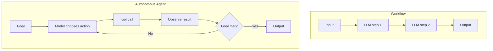

# Workflow vs Autonomous Agent

> A workflow runs LLM calls through predefined code paths; an autonomous agent directs its own process and tool use.

## Summary

The distinction turns on who holds control. In a workflow, the code orchestrates the LLM
and the tools through predefined paths. In an autonomous agent, the LLM directs its own
process and its own tool use, and it keeps control over how it reaches the goal. Anthropic
draws this line in "Building effective agents" and advises the simplest option that solves
the task. A workflow gives predictability. An agent gives flexibility at the cost of
control.

## How It Works

A workflow fixes the path at design time. The engineer sequences the LLM calls, the
routes, and the tools. An agent fixes the goal and the toolset, then lets the model choose
each step from environmental feedback. The agent runs an open loop until it finishes or
hits a checkpoint.

Anthropic names five workflow patterns: prompt chaining, routing, parallelisation,
orchestrator-workers, and evaluator-optimiser. The autonomous agent suits open-ended
tasks where the step count resists prediction.

## Strengths

- A workflow gives predictable cost, latency, and behaviour.
- A workflow tests and debugs step by step.
- An agent handles open-ended tasks a fixed path cannot cover.
- An agent adapts to feedback the designer did not foresee.

## Weaknesses

- A workflow breaks when the task leaves its fixed path.
- An agent costs more and behaves less predictably.
- An agent needs guardrails, checkpoints, and a step budget.
- An agent resists debugging because its path shifts per run.

## Appropriate Use Cases

- Workflow: a task with known steps, such as classify then route then reply.
- Workflow: a pipeline that needs a predictable cost and audit trail.
- Agent: open-ended research, coding, or triage with an unknown step count.
- Agent: a task where the model must recover from its own errors.

## Implementation Complexity

Low to moderate for a workflow; the path is explicit. High for an autonomous agent; it
needs a loop, tools, guardrails, and stop conditions. Start with a workflow and add
autonomy only where the task demands it.

## Scalability

A workflow scales with clear cost per step. An agent scales to harder tasks but its cost
and latency vary per run. Bound the agent with a step budget and a token cap.

## Maintenance Implications

A workflow drifts when a step contract changes; update the path. An agent drifts when a
tool or a prompt changes its behaviour; watch traces and cost. Keep a human checkpoint on
any high-stakes agent action.

## Related

- [[what-is-an-ai-agent]]
- [[agent-vs-llm]]
- [[the-agent-loop]]
- [[supervisor-worker-multi-agent]]
- [[best-practices-index]]

## Sources

- Anthropic, "Building effective agents". https://www.anthropic.com/engineering/building-effective-agents

## See also

- [[MOC - Architectures]]
- [[MOC - Agent Patterns]]
