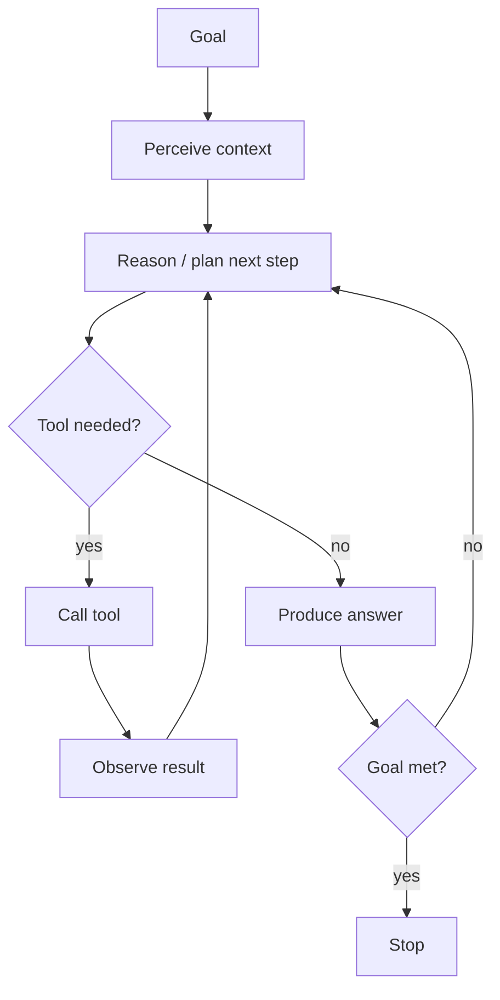
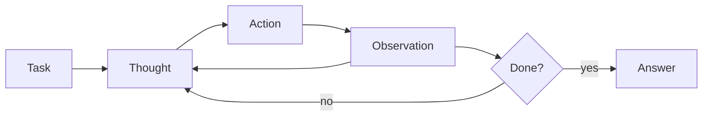
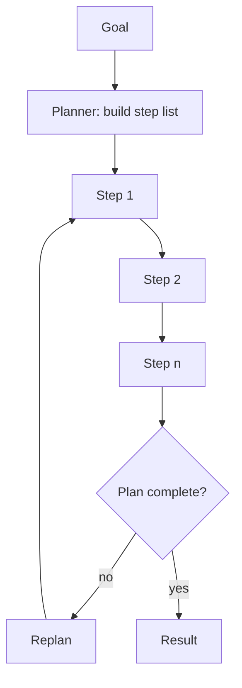
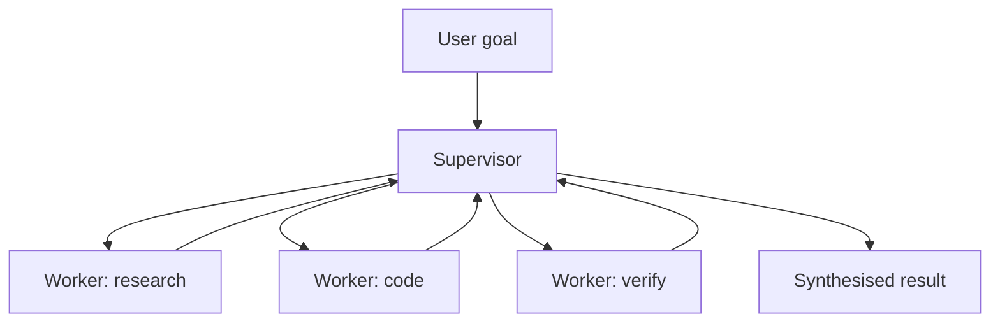
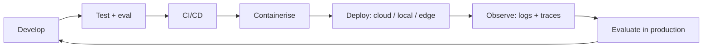

# Mermaid Diagram Library

Reusable diagram sources. Copy a block into any note inside a ```mermaid fence.

## The Agent Loop



Used by [[the-agent-loop]].

## ReAct



Used by [[react]].

## Plan-and-Execute



Used by [[plan-and-execute]].

## Supervisor-Worker



Used by [[supervisor-worker-multi-agent]].

## Deployment Pipeline



## See also

- [[MOC - Architectures]]
- [[MOC - Deployment]]
